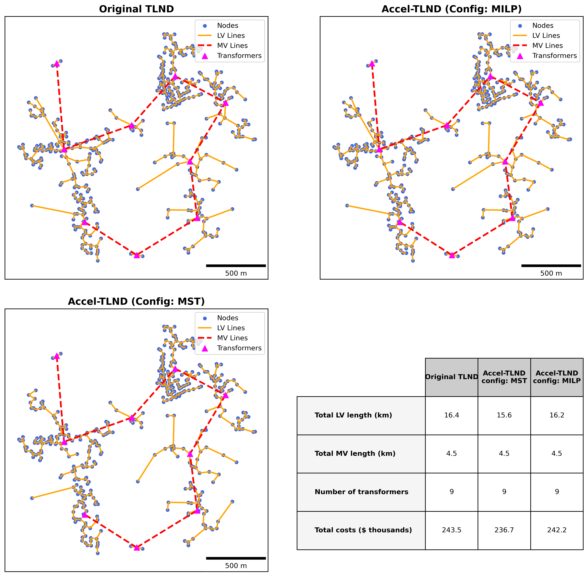

# Accelerated Two-Level Network Design Model

## Repository Structure

This script processes geospatial data to design and evaluate a local network with two levels: low-voltage and medium-voltage. It inputs a geospatial file and outputs the network layout along with relevant metrics.

```
fast_tlnd/
├── inputs/                       # Folder for input files
│   └── ......                   
├── results/                      # Output files (auto-generated)
├── scripts/
    ├── main.py                       # Main script to run the project
    ├── params.yaml                   # Configuration file for setting the case
    ├── network_design.py             # Network design code
    ├── outlier_exclusion.py          # The optional outlier exclusion
    └── write_outputs.py              # Write the output files
└── requirements.txt
```

## Dependencies

The project requires the Python packages listed in the requirements.txt file. Additionally, Gurobi is used for optimization, which requires a valid license (free academic licenses are available). To install the required packages, use the following command:
```bash
pip install -r requirements.txt
```

## How to Run the Model

1. **Set Up Your Input File:**
   - Place your input geospatial file (e.g., Shapefile or GeoJSON) in the `inputs/` directory.
   - Ensure the CRS of your file matches the required system.
   - Edit the input file path in the `params.yaml` configuration file.

2. **Edit Configuration:**
   - Open `params.yaml` and adjust the parameters as needed.

3. **Run the Script:**
   - Execute the main script:
     ```bash
     python scripts/main.py
     ```

4. **Outputs:**
   - The generated output files are saved in the results/<project_name>/ directory, including shapefiles and summary metrics.


# Model Computation Overview

## Merging and Clustering

The algorithm begins by treating each individual node as a distinct cluster, with each cluster representing a potential transformer location. It then implements an iterative merging procedure that continues until no clusters are within the specified proximity threshold.

During each iteration, the algorithm first calculates distances between all cluster center pairs and sorts them in ascending order. Starting with the closest pair, it evaluates potential mergers by calculating a new weighted center point. The merger proceeds only if the distance between this new center and every node in the potential combined cluster remains under the threshold (e.g., 500m). If a merger attempt fails, the algorithm moves to the next closest pair. Upon successful merger, the cluster list updates and a new iteration begins. The process terminates when no valid mergers are possible among any cluster pairs. At this point, transformer locations are established at the center points of the final clusters.

The algorithm's computation time scales with the number of structures:

- **100 structures:** <1 second  
- **500 structures:** ~10 seconds  
- **800 structures:** ~30 seconds  
- **4000 structures:** ~25 minutes  

These times represent core-seconds (CPU core - second) and may vary depending on the machine used. Some slowdown may occur when running in parallel. Overall, this performance indicates efficient processing for typical mini-grid scenarios (<1000 structures).

## LV and MV Network Design

The transformer locations and structure clusters determined by the merging process form the foundation for the network layout. Then, the medium-voltage (MV) network is designed using a minimum spanning tree (MST) algorithm on transformer locations, which finds the shortest total distance to connect all transformers based on a distance matrix between pairs. For implementation, the MST version uses `scipy`'s built-in functions, ensuring robustness.

Next, the question to solve is designing low-voltage (LV) networks within each transformer cluster. The original Two-Level-Network Design method used Capacitated MST with 500m transformer-to-structure distance constraints but faced computational challenges. To overcome these limitations, two alternative approaches are developed:

### MST Approach
This version applies standard MST algorithms to each cluster's LV design without transformer-to-structure distance constraints. This streamlined method reduces computation time from 240s to <1s while maintaining over 95% LV pattern similarity, though it relaxes path distance requirements. Implementation uses `scipy` for efficient processing.

### MILP Approach (Gurobi license required)
This version leverages Gurobi to achieve superior cost optimization while maintaining the 500m path distance constraint. It allows for time-capped execution, returning feasible sub-optimal solutions when needed. This overcomes the previous heuristic method's limitation of unpredictable runtime lengths while delivering more optimized network layouts. This method also achieves better (less costly) results compared to the original model.


## A comparion between TLND and Accel-TLND

The figure below compares the LV network layouts produced by TLND and Accel-TLND using both MST and MILP configurations. All methods result in identical node clustering, transformer placement, and MV layouts. TLND and the MILP configuration create branched LV structures to meet the maximum transformer-to-node distance constraint, while the MST configuration forms longer, continuous lines.

<p align="center">
  
</p>


## Outlier Exclusion Function

Functions in `scripts/outlier_exclusion.py` use DBSCAN clustering to automatically identify and remove geospatial outliers that can distort community distribution metrics. When `outlier_exclusion_case` is True in the params.yaml, it runs as a preprocessing step before network design to ensure robust cost calculations.

**Usage:**
```python
filtered_nodes = exclude_outliers(nodes_gdf, eps=100, min_samples=5)
```

**Parameters:**
- `nodes_gdf`: GeoDataFrame containing node geographic information
- `eps`: Distance threshold in meters (default: 100)
- `min_samples`: Minimum nodes to form a cluster (default: 5)

The function leverages sklearn's DBSCAN implementation and can be used independently from the main model for outlier detection in geospatial datasets.


## Structure Merging Function

This is a preprocessing step. Open-source building footprint data, developed from satellite imagery, reflects predicted building structures. In rural areas, it’s common for a single household to have multiple nearby structures. According to Uganda’s 2024 census, there are 10.7 million households, while Google’s Open Buildings data detects 18.4 million structures. In urban areas, merging may not be necessary due to multi-family housing, but in rural regions, it helps approximate household locations for further analysis. And in our study,
See details about the process here: [Strutcure Merge Preparation](scripts/preparation/README_str_merge.md)
